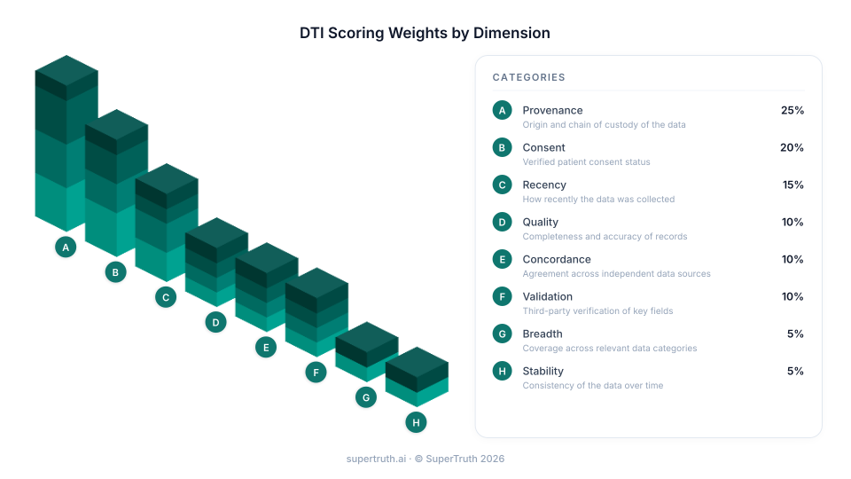
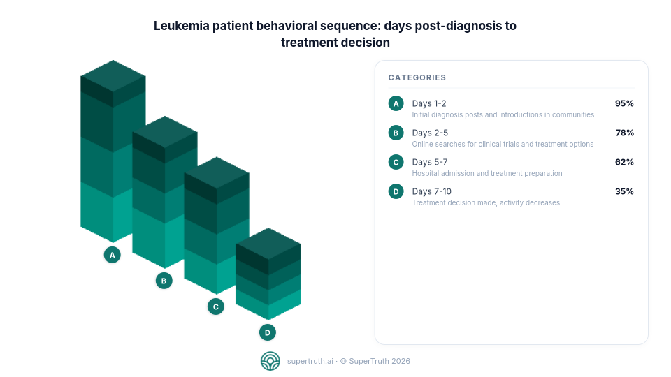
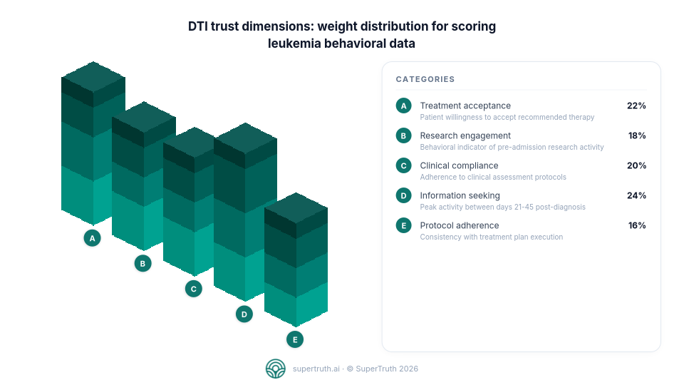
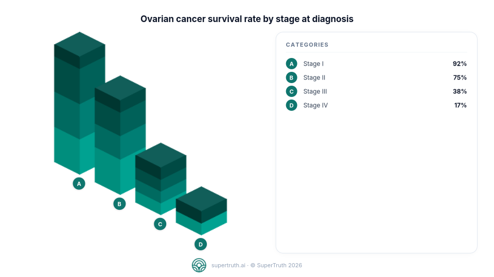
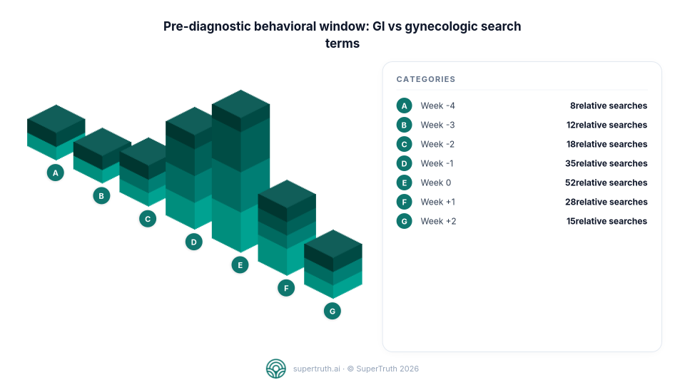

# stax

**Server-side isometric 3D bar chart generation for Node.js.**

No browser. No Puppeteer. No external service. Pure PNG output. Drop it in any Node.js environment — Next.js API routes, Express, Railway workers, Lambda, cron jobs — and get a pixel-perfect isometric chart back as a `Buffer`.

An [Artists & Robots](https://artistsandrobots.com) project by [Jason Alan Snyder](https://evilrobot.com).

[](LICENSE)

---



---

## Why this exists

I'm the co-founder of [Artists & Robots](https://artistsandrobots.com) and [SuperTruth](https://supertruth.ai). For the SuperTruth blog, I wanted isometric stacked-cube charts — the kind that make data feel dimensional — generated server-side so they could be embedded directly in blog posts, emails, and dynamically generated images.

There was no library that did this. Everything was browser-only, a Chrome extension, or a React component. Getting [obelisk.js](https://github.com/nosir/obelisk.js) — the only serious isometric canvas library — running inside Node.js with [node-canvas](https://github.com/Automattic/node-canvas) and JSDOM took a few days of real pain. The result now powers every chart on [supertruth.ai/blog](https://supertruth.ai/blog). I figured others would benefit from having this solved.

---

## Install

**From GitHub (available now):**

```bash
npm install github:evil-robot/stax
```

**From npm (coming soon):**

```bash
npm install @artistsandrobots/stax
```

### Native dependency note

`stax` uses [node-canvas](https://github.com/Automattic/node-canvas), which requires native build tools.

**macOS:**
```bash
brew install pkg-config cairo pango libpng jpeg giflib librsvg
```

**Linux / Railway / Docker:**
```bash
apt-get install build-essential libcairo2-dev libpango1.0-dev libjpeg-dev libgif-dev librsvg2-dev
```

**Vercel / Lambda:** node-canvas ships prebuilt binaries for the most common runtimes — no manual install needed in most cases.

---

## Quick start

```ts
import { renderChart } from '@artistsandrobots/stax';
import { writeFileSync } from 'fs';

const png = renderChart({
  title: 'Analysis Time: Before vs After AI',
  labels: ['Ingestion', 'Scoring', 'QA Review', 'Reporting', 'Delivery'],
  values: [42, 18, 31, 25, 9],
  unit: ' hrs',
});

writeFileSync('chart.png', png);
```

`png` is a `Buffer`. Write it to disk, upload to S3, embed in markdown, stream it from an API route — whatever you need.

---

## Use cases

### Next.js API route

```ts
// app/api/chart/route.ts
import { renderChart } from '@artistsandrobots/stax';
import { NextResponse } from 'next/server';

export async function POST(req: Request) {
  const spec = await req.json();
  const png = renderChart(spec);
  return new NextResponse(png, {
    headers: { 'Content-Type': 'image/png' },
  });
}
```

### Express endpoint

```ts
app.post('/chart', (req, res) => {
  const png = renderChart(req.body);
  res.set('Content-Type', 'image/png').send(png);
});
```

### Embed in markdown (blog posts, emails)

```ts
const png = renderChart(spec);
const dataUri = `data:image/png;base64,${png.toString('base64')}`;
const markdown = ``;
```

### Upload to S3

```ts
import { S3Client, PutObjectCommand } from '@aws-sdk/client-s3';

const png = renderChart(spec);
await s3.send(new PutObjectCommand({
  Bucket: 'my-bucket',
  Key: 'charts/output.png',
  Body: png,
  ContentType: 'image/png',
}));
```

---

## Real output

These charts are generated server-side on [supertruth.ai/blog](https://supertruth.ai/blog) using stax. Every post gets a chart — rendered at write time, embedded inline, no client-side code.

**[Leukemia patient community: what behavioral signals precede treatment decisions?](https://supertruth.ai/blog/leukemia-patient-community-behavior-what-online-signals-precede-treatment-decisi)**





**[Ovarian cancer awareness gap: what behavioral data reveals before diagnosis](https://supertruth.ai/blog/ovarian-cancer-awareness-gap-what-behavioral-data-reveals-before-diagnosis)**





---

## API reference

```ts
renderChart(spec: ChartSpec): Buffer
```

### ChartSpec

| Field | Type | Default | Description |
|---|---|---|---|
| `title` | `string` | required | Chart title. Wraps to two lines at 60 characters. |
| `labels` | `string[]` | required | Label for each bar. Maximum 12 bars (A–L). |
| `values` | `number[]` | required | Numeric value for each bar. |
| `unit` | `string` | `""` | Appended to each value in the legend. Pass `"%"`, `" hrs"`, `"x"`, etc. |
| `descriptions` | `string[]` | — | Optional subtext shown under each label in the legend card. |
| `width` | `number` | `960` | Canvas width in px. |
| `height` | `number` | `540` | Canvas height in px. |
| `brandText` | `string` | stax attribution | Text in the bottom brand strip. Pass `""` to hide it entirely. |
| `brandLogo` | `string` | — | Absolute path to a logo image file. Drawn left of `brandText`. |
| `palette` | `number[]` | teal gradient | Cube face colors as hex integers. Ordered light → dark (base → top of stack). |

### Notes

- Bar heights are relative: the tallest bar always reaches `MAX_STACKS` (10 cubes) and others scale proportionally.
- Values ≤ 0 render as a single-cube minimum bar — they never disappear entirely.
- Labels longer than the legend column are truncated with an ellipsis.
- `unit` is appended without a space — if you want `42 hrs`, pass `unit: " hrs"` (leading space included).

---

## Design tokens

Every dimension, color, and typographic value lives in `src/tokens.ts`. The full token system:

```ts
// Cube geometry (obelisk iso units)
export const CUBE = {
  W:   40,   // cube face width
  H:   18,   // single stack unit height
  GAP: 22,   // gap between bar columns
};

// Canvas layout
export const CHART = {
  WIDTH:      960,
  HEIGHT:     540,
  MAX_STACKS: 10,    // tallest bar = this many cubes
  CHART_FRAC: 0.55,  // fraction of body width for the chart area
  BRAND_BAND: 46,    // brand strip height at bottom
};

// Default cube palette (top-face hex integers)
export const PALETTE = {
  cubes: [
    0x14B8A6, // teal-500 — base
    0x0D9488, // teal-600
    0x0F766E, // teal-700
    0x115E59, // teal-800 — top
  ],
};
```

### Custom palette per render

Pass any array of hex integers. obelisk.js derives the left and right face shading automatically from the top-face color.

```ts
// Indigo
renderChart({ ...spec, palette: [0x6366F1, 0x4F46E5, 0x4338CA, 0x3730A3] });

// Rose
renderChart({ ...spec, palette: [0xFB7185, 0xF43F5E, 0xE11D48, 0xBE123C] });

// Amber
renderChart({ ...spec, palette: [0xFBBF24, 0xF59E0B, 0xD97706, 0xB45309] });
```

---

## How it works

obelisk.js is a browser-only library — it expects `window`, `document`, and a real DOM canvas. stax bridges the gap:

1. A [JSDOM](https://github.com/jsdom/jsdom) environment is created and patched so that `document.createElement('canvas')` returns a [node-canvas](https://github.com/Automattic/node-canvas) surface instead of a DOM element
2. obelisk.js is evaluated inside this environment via `eval()` on the bundled `obelisk.min.js`
3. The isometric cubes are rendered onto the node-canvas surface
4. A second full-size canvas composes the two-column layout: chart, legend card, title, markers, and brand strip
5. `canvas.toBuffer('image/png')` returns the final PNG as a Node.js `Buffer`

```
ChartSpec
  → JSDOM shim
  → obelisk.js (iso cube renderer)
  → node-canvas (Cairo-backed 2D context)
  → Buffer (PNG)
```

The JSDOM instance and obelisk.js evaluation are lazy and cached — the first call takes ~50ms to initialize, subsequent calls render in ~10ms.

---

## Platform compatibility

| Platform | Status | Notes |
|---|---|---|
| Local Node.js | Works | Install native deps via Homebrew |
| Railway | Works | Add `apt-get` build deps to Dockerfile or Nixpacks config |
| Vercel | Works | Prebuilt node-canvas binaries for Node 18/20 |
| AWS Lambda | Works | Use a Lambda layer with node-canvas prebuilt binary |
| Docker (Alpine) | Works | Use `node:lts-bookworm` base, add apt deps |
| Cloudflare Workers | Not supported | No Node.js native module support |

---

## Used by

**[SuperTruth](https://supertruth.ai)** — healthcare intelligence platform. Generates isometric charts for every post on [supertruth.ai/blog](https://supertruth.ai/blog) using stax. Charts are rendered server-side during post generation and embedded as inline PNG data URIs — no CDN, no client-side rendering, no build step.

---

## About

**[Artists & Robots](https://artistsandrobots.com)** is a human-first AI studio building intelligent platforms for media, healthcare, and commerce.

**[SuperTruth](https://supertruth.ai)** is the truth layer underneath healthcare intelligence — consent-verified, integrity-scored patient data that powers better decisions.

Built by [Jason Alan Snyder](https://evilrobot.com), co-founder of both.

MIT License. Copyright (c) 2026 Jason Alan Snyder / Artists & Robots.
